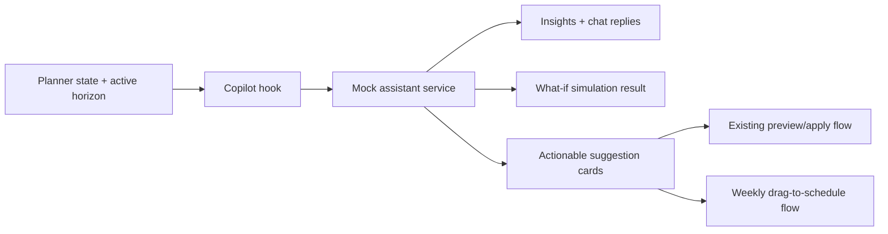

# AI-Centric Maintenance Planner — Phase 4 Execution Plan

## Goal

Implement **Phase 4: AI Assistant Copilot** on top of the current local baseline, which already supports:

- weekly AI plan generation
- phase 2 preview / selective apply
- phase 3 multi-plan comparison

The objective of Phase 4 is to turn the current planner AI entry surface into an **interactive, context-aware copilot** that can answer planner questions, simulate what-if changes, and emit actionable AI suggestions that tie back into the existing weekly planner flow.

## Current Baseline

The codebase is currently at a strong **phase 3 weekly planning** state, but not yet at a true copilot experience.

### What exists now

- `src/Maintenance/pages/MaintenancePlannerPage.tsx`
  - mounts the planner AI entry surface
  - owns planner surface mode (`Weekly`, `Monthly`, `Quarterly`, `Annual`)
  - already exposes a reschedule handler seam that an assistant can reuse
- `src/Maintenance/hooks/usePlannerAi.ts`
  - manages AI generation, comparison, active variant, preview state, compare-dialog state, and apply behavior
- `src/Maintenance/ai/mockPlannerAiService.ts`
  - generates the current mock plan / comparison results
- `src/Maintenance/ai/generatePlannerAiPlan.ts`
  - produces weekly strategies from planner, follow-up, CBM/PdM, and spare-parts signals
- `src/Maintenance/components/ai/PlannerAiOverviewPanel.tsx`
  - still acts as a summary + CTA panel, not a copilot
- `src/Maintenance/components/ai/PreviewAiPlanDialog.tsx`
  - previews one selected strategy
- `src/Maintenance/components/ai/ComparePlansDialog.tsx`
  - compares strategies side-by-side

### Most important current constraints

The current code shows why Phase 4 should focus on copilot behavior rather than more comparison work:

```2027:2054:src/Maintenance/pages/MaintenancePlannerPage.tsx
function AssistantPanel({
  generatedPlan,
  overviewItems,
  isGenerating,
  onGeneratePlan,
  onReviewPlan,
  onComparePlans,
  onReschedule: _onReschedule,
}: {
  generatedPlan: PlannerAiPlan | null;
  overviewItems: string[];
  isGenerating: boolean;
  onGeneratePlan: () => void | Promise<void>;
  onReviewPlan: () => void;
  onComparePlans: () => void;
  onReschedule?: (cardId: string) => void;
}) {
  void _onReschedule;

  return (
    <PlannerAiOverviewPanel
      generatedPlan={generatedPlan}
      overviewItems={overviewItems}
      isGenerating={isGenerating}
      onGeneratePlan={onGeneratePlan}
      onReviewPlan={onReviewPlan}
      onComparePlans={onComparePlans}
    />
  );
}
```

The current assistant surface is only a wrapper around the overview panel, so there is no real assistant conversation yet.

```19:24:src/Maintenance/hooks/usePlannerAi.ts
type UsePlannerAiOptions = {
  cards: PlannerAiCalendarCardInput[];
  planningItems: PlannerAiPlanningItemInput[];
  setCards: Dispatch<SetStateAction<PlannerAiCalendarCardInput[]>>;
  setPlanningItems: Dispatch<SetStateAction<PlannerAiPlanningItemInput[]>>;
};
```

The AI hook currently does not receive surface context, selected asset context, or hypothetical intent input, so it cannot yet adapt suggestions to weekly vs. monthly vs. quarterly vs. annual usage.

```59:60:src/Maintenance/components/ai/PlannerAiOverviewPanel.tsx
<Typography sx={{ mt: 0.6, color: tokenText.secondary, fontSize: '0.78rem', lineHeight: 1.45 }}>
  Generate and compare weekly AI strategies from the planner board, Follow-Up backlog, CBM/PdM signals, and spare-parts readiness.
```

The UI is still explicitly framed around weekly strategy generation, not a horizon-aware copilot.

```115:119:src/Maintenance/components/ai/AIScheduleChangesTable.tsx
<Box sx={{ display: 'flex', alignItems: 'flex-start', pt: 0.2 }}>
  <Checkbox
    checked={selected}
    onChange={() => onToggleAction(action.id)}
    sx={{ p: 0 }}
  />
```

Recommendations are still checkbox/apply based, not draggable assistant suggestions.

## Target Outcome

By the end of Phase 4, the planner should support:

1. **Interactive assistant**
   - planner can ask questions like:
     - "What is the riskiest asset this week?"
     - "Why did AI choose this strategy?"
     - "Show only suggestions for monthly planning."

2. **Context-aware suggestions**
   - assistant changes its recommendation set depending on the active horizon:
     - weekly: execution / reschedule / assignment / current blockers
     - monthly: backlog compression / route balancing / compliance risk
     - quarterly: reliability hotspots / shutdown clustering / resource conflicts
     - annual: overdue exposure / strategic PM load / long-range risk pattern

3. **What-if simulation**
   - planner can simulate changes such as:
     - move a PM to next week
     - defer a low-risk PM
     - compress a set of tasks into one shutdown window
   - assistant returns impact on risk, downtime, backlog, readiness, and capacity

4. **Drag-to-schedule AI suggestions**
   - AI emits suggestion cards that can either:
     - open the existing reschedule flow
     - be dragged into the weekly board directly

## Proposed Flow



## Implementation Plan

### 1. Extend the AI domain for copilot interactions

Update `src/Maintenance/ai/types.ts` with assistant-specific contracts instead of forcing copilot state into the current plan-comparison types.

Add types for:

- assistant messages / turns
- assistant insight cards
- horizon context (`weekly`, `monthly`, `quarterly`, `annual`)
- what-if requests and simulation results
- drag-capable suggestion items
- assistant intent / action targets

Keep the current phase 2 / phase 3 plan types stable so preview and comparison continue to work untouched while copilot capabilities are added.

### 2. Add a mock copilot service layer

Extend `src/Maintenance/ai/mockPlannerAiService.ts` and `src/Maintenance/ai/generatePlannerAiPlan.ts` with a dedicated assistant service path.

Recommended direction:

- keep plan generation / plan comparison APIs as-is
- add new mock assistant entry points for:
  - `requestMockPlannerAiInsights`
  - `requestMockPlannerAiWhatIf`
  - `requestMockPlannerAiSuggestions`

Use the same underlying planner inputs already used in phase 1-3, but add active horizon and optional user question / hypothesis input.

### 3. Upgrade the planner AI hook into a copilot orchestrator

Refactor `src/Maintenance/hooks/usePlannerAi.ts` so it can manage:

- assistant open / close state
- current horizon context
- chat / assistant transcript
- insight list
- pending what-if simulation
- suggestion cards
- active dragged suggestion

This hook should still preserve the current responsibilities:

- generation
- comparison
- preview
- selective apply

But it should become the single coordinator for **assistant + plan workflows**.

Recommended change:

- pass `plannerSurfaceMode` into `usePlannerAi()`
- optionally pass selected card / asset context later if needed

### 4. Replace the summary-only assistant shell with a true copilot panel

Refactor the current `AssistantPanel` / `PlannerAiOverviewPanel` entry surface into a richer assistant UI.

Likely new components:

- `src/Maintenance/components/ai/PlannerAiCopilotPanel.tsx`
- `src/Maintenance/components/ai/PlannerAiConversation.tsx`
- `src/Maintenance/components/ai/PlannerAiInsightList.tsx`
- `src/Maintenance/components/ai/PlannerAiSuggestionCard.tsx`
- `src/Maintenance/components/ai/PlannerAiWhatIfPanel.tsx`

Expected behavior:

- planner sees horizon-aware prompts
- planner can trigger quick questions
- assistant returns structured answers and suggested actions
- current buttons (`Generate AI plan`, `Compare plans`, `Review plan`) remain accessible, but become part of the copilot experience instead of being the whole experience

### 5. Implement horizon-aware context behavior

Use `plannerSurfaceMode` from `src/Maintenance/pages/MaintenancePlannerPage.tsx` as the first context input.

```2064:2068:src/Maintenance/pages/MaintenancePlannerPage.tsx
const options: Array<{ id: PlannerSurfaceMode; label: string }> = [
  { id: 'calendar', label: 'Weekly' },
  { id: 'monthly', label: 'Monthly' },
  { id: 'gantt', label: 'Quarterly' },
  { id: 'annual', label: 'Annual' },
];
```

Phase 4 should map those modes into different assistant prompt sets and insight logic.

Suggested minimum behavior:

- `calendar` -> execution and reschedule suggestions
- `monthly` -> compliance and backlog balance insights
- `gantt` -> cluster / shutdown / reliability suggestions
- `annual` -> overdue and strategic PM load insights

### 6. Add user-driven what-if simulation

Implement a first-pass what-if flow that is **planner initiated**, not only AI initiated.

Recommended minimum slice:

- allow the planner to ask:
  - move selected work to another day
  - defer selected PM by one cycle
  - bundle work into one shutdown window
- return a mock impact panel with:
  - risk delta
  - downtime delta
  - backlog delta
  - parts-readiness impact
  - labor / slot fit warning

Reuse the existing preview and explanation patterns where possible so this does not become a visually separate product.

### 7. Add drag-to-schedule assistant suggestions

The weekly board already exposes an assistant reschedule seam:

```5516:5537:src/Maintenance/pages/MaintenancePlannerPage.tsx
useEffect(() => {
  if (!onAssistantRescheduleReady) {
    return undefined;
  }

  onAssistantRescheduleReady((cardId: string) => {
    const card = cards.find((currentCard) => currentCard.id === cardId);
    if (!card) {
      return;
    }

    onOpenReschedule({
      cardId: card.id,
      fromShift: card.shift,
      fromDay: card.day,
      toShift: card.shift,
      toDay: card.day,
    });
  });

  return () => {
    onAssistantRescheduleReady(null);
  };
}, [cards, onAssistantRescheduleReady, onOpenReschedule]);
```

Phase 4 should reuse this rather than building a second reschedule path.

Minimum target:

- assistant suggestion cards can trigger the existing reschedule flow
- at least one weekly suggestion type can be dragged into the board
- drag behavior should be incremental, not a full rewrite of existing DnD primitives

### 8. Verify the phase 4 slice end to end

Validation should cover:

- existing phase 3 generate / compare / preview / apply still works
- assistant replies change with horizon context
- at least one what-if simulation path works
- at least one assistant suggestion can trigger reschedule
- at least one assistant suggestion can be dragged into the weekly board

Run IDE lint diagnostics on touched files after implementation and fix introduced issues. If command-line TypeScript validation is available again, run `npm run lint` too.

## Recommended File Touch Order

1. `src/Maintenance/ai/types.ts`
2. `src/Maintenance/ai/mockPlannerAiService.ts`
3. `src/Maintenance/hooks/usePlannerAi.ts`
4. `src/Maintenance/components/ai/PlannerAiOverviewPanel.tsx` or replacement copilot shell
5. new assistant-specific AI components
6. `src/Maintenance/pages/MaintenancePlannerPage.tsx`
7. optional integration tweaks to `src/Maintenance/components/ai/AIScheduleChangesTable.tsx` and `src/Maintenance/components/ai/PreviewAiPlanDialog.tsx`

## Acceptance Criteria

- The planner exposes an interactive AI copilot surface, not only summary CTA cards.
- Assistant insight content changes based on the active horizon.
- The planner can run at least one explicit what-if simulation from current planner state.
- Assistant suggestions can drive the existing weekly reschedule path.
- At least one assistant suggestion can be dragged into the weekly board.
- Phase 3 comparison and selective-apply behavior remain intact.
