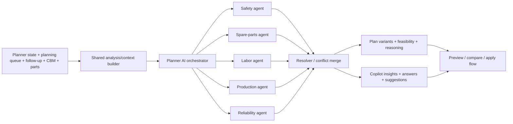

# AI-Centric Maintenance Planner - Phase 5 Execution Plan

## Goal

Implement **Phase 5: Multi-Agent System** on top of the current local baseline, which already supports:

- weekly AI plan generation and selective apply
- multi-plan comparison
- horizon-aware copilot prompts and replies
- mock what-if simulation
- one drag-to-schedule assistant suggestion path

The objective of Phase 5 is to replace the current **agent-flavored but centralized** planner logic with a real **mock-backed orchestrator + specialist agent layer** that produces structured reasoning, conflicts, blockers, and merged recommendations without breaking the existing phase 4 user experience.

## Current Baseline

The codebase is currently at a strong **phase 4 copilot** state, but not yet at a true multi-agent architecture.

### What exists now

- `src/Maintenance/ai/types.ts`
  - already models plan, comparison, copilot, and what-if contracts
  - already has `PlannerAiAgentContributor`, but only as a label list on actions
- `src/Maintenance/ai/generatePlannerAiPlan.ts`
  - centralizes input analysis, variant generation, copilot insights, suggestions, and what-if output in one file
  - already brands output as a mock orchestrator, but does not actually run specialist agents
- `src/Maintenance/ai/mockPlannerAiService.ts`
  - provides async wrappers around the centralized generator
- `src/Maintenance/hooks/usePlannerAi.ts`
  - coordinates generation, comparison, preview, copilot, and drag/apply flows
  - does not yet hold any explicit agent-run or resolver state
- `src/Maintenance/components/ai/AIAgentReasoningPanel.tsx`
  - already renders per-agent reasoning content
  - currently consumes reasoning that is synthesized centrally rather than emitted by real specialist evaluators

### Most important current constraints

Phase 5 should be planned around the actual implementation seams that already exist:

- the "orchestrator" is currently only a label in generated output, not a real coordination layer
- specialist domains are not isolated into their own files or contracts yet
- plan variants are still assembled directly inside `generatePlannerAiPlan.ts`
- copilot insights and replies are derived from the same centralized analysis rather than from actual agent traces
- there is no `Safety` specialist yet in the current `PlannerAiAgentContributor` union
- there is no conflict-resolution model for cases like:
  - reliability wants to pull work forward
  - spare parts says execution is blocked
  - labor says day-level concentration is too high
  - production says the chosen slot creates avoidable disruption

## Phase 5 Target Outcome

By the end of Phase 5, the planner should support:

1. **Typed specialist agents**
   - Safety
   - Spare Parts
   - Labor
   - Production
   - Reliability

2. **A real orchestration pass**
   - one shared planner context is built once
   - specialist agents evaluate that same context
   - an orchestrator resolves conflicts and merges recommendations

3. **Agent-grounded plan generation**
   - preview, comparison, and feasibility outputs come from merged agent results
   - "agent reasoning" is no longer just narrative dressing on top of centralized logic

4. **Agent-aware copilot behavior**
   - copilot answers "why" questions from specialist outputs
   - insight cards and suggestions cite the agent domains that shaped them

5. **No regression to existing user flows**
   - generate plan
   - review plan
   - compare plans
   - selective apply
   - what-if
   - drag suggestion into weekly board

## Execution Principles

- Keep the implementation **mock-backed and deterministic** in phase 5. Do not add real backend, LLM, or streaming dependencies yet.
- Keep the **weekly board** as the only direct execution surface. Monthly, quarterly, and annual horizons can consume richer reasoning without becoming direct apply surfaces in this phase.
- Prefer **pure functions and typed contracts** for agent evaluation so the same orchestration result can feed preview, comparison, and copilot surfaces.
- Reuse the existing UI components where possible instead of introducing a second AI review surface.
- Preserve current phase 4 behavior unless the new multi-agent path is explicitly replacing it.

## Proposed Architecture



## Recommended Module Layout

Phase 5 should introduce a small internal architecture under `src/Maintenance/ai/` rather than continuing to grow one generator file:

```text
src/Maintenance/ai/
├── agents/
│   ├── plannerAiAnalysis.ts
│   ├── plannerAiOrchestrator.ts
│   ├── reliabilityAgent.ts
│   ├── sparePartsAgent.ts
│   ├── laborAgent.ts
│   ├── productionAgent.ts
│   └── safetyAgent.ts
├── generatePlannerAiPlan.ts
├── mockPlannerAiService.ts
└── types.ts
```

This keeps the current public entry points stable while making the internal multi-agent system easier to reason about.

## Implementation Plan

### 1. Expand the AI domain for multi-agent contracts

Update `src/Maintenance/ai/types.ts` so the codebase has first-class types for multi-agent execution instead of only display-level agent labels.

Add types for:

- agent ids / agent kinds
- shared orchestration context
- agent findings
- agent blockers and warnings
- agent confidence breakdown
- agent action proposals
- agent conflicts
- resolved decisions
- orchestration run summary

Also update the current contributor model so it can represent:

- `Safety`
- `Spare Parts`
- `Labor`
- `Production`
- `Reliability`
- `Planner`
- `Follow-Up`

Keep current plan, comparison, and copilot types stable where possible, but enrich them with agent-run outputs instead of replacing every existing field at once.

### 2. Extract shared planner analysis into a dedicated context builder

Move shared analysis out of `src/Maintenance/ai/generatePlannerAiPlan.ts` into a reusable module such as `src/Maintenance/ai/agents/plannerAiAnalysis.ts`.

That context builder should own:

- normalized planner state
- follow-up snapshot access
- highest-risk asset ranking
- parts-readiness lookup aggregation
- baseline KPI derivation
- helper summaries used across plan generation and copilot features

The important rule is: **analysis happens once**, then all specialists consume the same context.

### 3. Implement specialist agents as isolated evaluators

Create one evaluator file per specialist domain:

- `reliabilityAgent.ts`
  - rank failure exposure
  - identify pull-forward candidates
  - recommend strategy pressure based on CBM/PdM severity
- `sparePartsAgent.ts`
  - validate readiness
  - emit blockers, warnings, and substitute/ETA notes
  - prevent blocked work from looking execution-ready
- `laborAgent.ts`
  - review technician fit, daily concentration, and assignment pressure
  - identify actions that are valid but labor-tight
- `productionAgent.ts`
  - flag avoidable downtime fragmentation
  - reward bundling into existing stop windows
  - shape trade-offs for min-downtime vs. balanced variants
- `safetyAgent.ts`
  - add initial mock safety checks for zone overlap, hazardous pairing, permit-style blockers, and elevated-review requirements

For this phase, each agent can remain heuristic and mock-backed. The key is the **contract and flow**, not full enterprise-grade data integration yet.

### 4. Build the orchestrator and resolver

Create `src/Maintenance/ai/agents/plannerAiOrchestrator.ts` to:

- call the shared context builder
- run all specialist evaluators from the same context
- normalize their outputs into one merged structure
- resolve contradictions between agent recommendations
- return:
  - merged action candidates
  - feasibility state
  - blocker list
  - confidence rollup
  - per-agent reasoning summaries
  - conflict notes for the UI

Recommended conflict examples to support in the first slice:

- Reliability says "schedule now" but Spare Parts says "blocked"
- Production says "cluster earlier" but Labor says "peak day overload"
- Reliability and Safety both support a move, but Safety requires a warning badge instead of direct pass

The resolver can stay deterministic in phase 5, but it should be designed so real async or weighted logic can be added later.

### 5. Rewire plan generation and comparison onto orchestration output

Refactor `src/Maintenance/ai/generatePlannerAiPlan.ts` so it no longer owns all specialist logic directly.

Instead, it should:

- ask the orchestrator for a merged baseline result
- derive strategy variants by changing strategy weights or action-selection posture
- build:
  - impact metrics
  - feasibility checklist
  - schedule delta
  - long-term metrics
  - per-agent reasoning
  - plan narrative
  - confidence factors
  from the orchestration result

This preserves the current phase 3 and phase 4 product behavior while making the data provenance real.

### 6. Upgrade the mock service and hook around agent-aware state

Update:

- `src/Maintenance/ai/mockPlannerAiService.ts`
- `src/Maintenance/hooks/usePlannerAi.ts`

The service layer should keep the same async UX, but the data it returns should now include orchestration detail.

The hook should gain lightweight state for:

- latest orchestration summary
- selected plan's agent outputs
- agent conflict details shown in preview/compare/copilot surfaces

Avoid a large hook rewrite. The priority is to expose **agent-aware data** while keeping:

- compare flow
- preview flow
- apply flow
- suggestion drag state

stable.

### 7. Upgrade the existing UI surfaces to show real agent traceability

Focus on existing components first:

- `src/Maintenance/components/ai/AIAgentReasoningPanel.tsx`
- `src/Maintenance/components/ai/AIConfidenceBadge.tsx`
- `src/Maintenance/components/ai/AIFeasibilityChecklist.tsx`
- `src/Maintenance/components/ai/PreviewAiPlanDialog.tsx`
- `src/Maintenance/components/ai/ComparePlansDialog.tsx`

Expected UI changes:

- show the actual specialist agents participating in the final recommendation
- show at least one merged conflict or caution note when agents disagree
- show per-agent confidence or stance where it adds value
- keep the current preview and compare layouts familiar

This phase should not require a brand-new dialog. It should deepen the current AI review experience.

### 8. Make copilot responses agent-aware

Update copilot generation so the assistant no longer answers only from centralized heuristics.

Use orchestration output to power:

- "Why did AI choose this strategy?"
- "What is blocking this work?"
- "Which agent is driving this recommendation?"
- horizon-aware insight cards
- recommendation suggestions tied to real agent pressure

Recommended scope control:

- keep the existing what-if UI and flow
- if full scenario re-orchestration is too large for the first implementation pass, at minimum attach agent-specific commentary to what-if output

### 9. Verify the phase 5 slice end to end

Validation should cover:

- existing phase 4 generate / compare / preview / apply still works
- generated plans now include outputs from all specialist agents
- at least one agent can block or downgrade an action
- per-agent reasoning shown in preview and comparison is sourced from orchestration output
- copilot explanation answers reflect real agent results
- weekly drag suggestion behavior still works

Run IDE lint diagnostics on touched files after implementation and fix introduced issues. If command-line linting is available, run it as a secondary check.

## Suggested Delivery Slices

### Slice A: Contracts and orchestration skeleton

- add types
- extract shared analysis
- add specialist agent files with minimal output
- add orchestrator + resolver skeleton

### Slice B: Plan generation and comparison integration

- route comparison session generation through orchestration
- preserve existing strategy cards and apply flow
- map confidence, feasibility, blockers, and reasoning from agent outputs

### Slice C: Copilot and UI traceability

- update preview and compare dialogs
- update agent reasoning panel
- update copilot replies and suggestions
- verify no regressions in drag/apply flows

This staged approach reduces risk and makes it easier to isolate regressions if a later UI change breaks an otherwise working orchestration core.

## Recommended File Touch Order

1. `src/Maintenance/ai/types.ts`
2. `src/Maintenance/ai/agents/plannerAiAnalysis.ts`
3. `src/Maintenance/ai/agents/reliabilityAgent.ts`
4. `src/Maintenance/ai/agents/sparePartsAgent.ts`
5. `src/Maintenance/ai/agents/laborAgent.ts`
6. `src/Maintenance/ai/agents/productionAgent.ts`
7. `src/Maintenance/ai/agents/safetyAgent.ts`
8. `src/Maintenance/ai/agents/plannerAiOrchestrator.ts`
9. `src/Maintenance/ai/generatePlannerAiPlan.ts`
10. `src/Maintenance/ai/mockPlannerAiService.ts`
11. `src/Maintenance/hooks/usePlannerAi.ts`
12. `src/Maintenance/components/ai/AIAgentReasoningPanel.tsx`
13. `src/Maintenance/components/ai/AIConfidenceBadge.tsx`
14. `src/Maintenance/components/ai/AIFeasibilityChecklist.tsx`
15. `src/Maintenance/components/ai/PreviewAiPlanDialog.tsx`
16. `src/Maintenance/components/ai/ComparePlansDialog.tsx`
17. `src/Maintenance/components/ai/PlannerAiCopilotPanel.tsx`
18. optional supporting copilot components if new agent details are surfaced there

## Out of Scope for Phase 5

To keep this phase finishable, do **not** expand scope into:

- real LLM or backend orchestration
- full cross-horizon cascade propagation
- approval workflow
- bundled maintenance package optimization
- real production-planning API integration
- real shift-management or permit-management integration
- turning monthly, quarterly, or annual boards into direct AI-apply surfaces

Those remain valid later-phase follow-ons once the multi-agent core exists.

## Acceptance Criteria

- The planner exposes outputs from **Safety, Spare Parts, Labor, Production, and Reliability** in the generated plan flow.
- At least one agent can explicitly block, warn, or downgrade a recommended action.
- Preview and comparison surfaces show per-agent reasoning that comes from the orchestration layer.
- Copilot strategy explanations reflect actual agent outputs rather than hardcoded narrative only.
- Existing phase 4 flows remain intact:
  - generate
  - review
  - compare
  - selective apply
  - what-if
  - drag-to-schedule
- No new lint issues are introduced in touched files.

## Recommended Starting Note for the Implementation Session

Phase 5 should start as a **mock-backed architecture refactor with visible user benefit**, not as a full platform integration effort.

The best first implementation move is:

1. create the orchestration contracts
2. extract shared analysis
3. land specialist agent files
4. route the existing comparison generator through the new orchestrator before touching UI

That sequencing gives the team a stable internal core before preview, compare, and copilot surfaces are updated.
