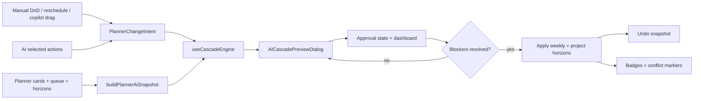
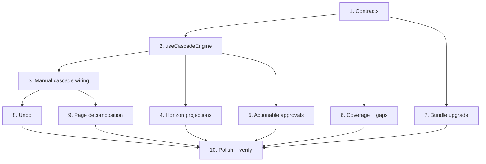

# AI-Centric Maintenance Planner — Phase 7 Execution Plan

## Goal

Implement **Phase 7: Hardening, Integration & Production Readiness** on top of the current local baseline, which already supports:

- weekly AI plan generation, comparison, and selective apply
- multi-agent orchestration with specialist evaluators
- horizon-aware copilot, what-if simulation, and weekly drag-to-schedule
- shared planner snapshot (`buildPlannerAiSnapshot`)
- cascade preview before AI apply (`generatePlannerAiCascadePreview`, `AICascadePreviewDialog`)
- horizon impact badges, basic coverage heatmap, approval display, and bundle cards

The objective of Phase 7 is to **close the functional gaps left by the Phase 6 first slice**, make cascade and approval behavior apply to **all meaningful schedule changes**, and deliver the polish work originally scoped for production readiness — without breaking phases 2–6 user flows.

## Current Baseline

The codebase is currently at a strong **phase 6 cascade-aware weekly planner** state, but not yet at a fully integrated multi-horizon decision system.

### What exists now

- `src/Maintenance/ai/buildPlannerAiSnapshot.ts`
  - normalized snapshot from weekly cards, queue, follow-up, CBM, parts, and staff skills
- `src/Maintenance/ai/generatePlannerAiCascadePreview.ts`
  - deterministic cascade preview, bundles, approvals, and conflicts
- `src/Maintenance/hooks/usePlannerAi.ts`
  - `openCascadePreview()` / `confirmCascadeApply()` for AI apply only
  - `plannerSnapshot`, `horizonImpacts`, `coverageSummary`, `appliedCascadePreview`
- `src/Maintenance/components/ai/`
  - `AICascadePreviewDialog.tsx`
  - `AIHorizonImpactBadges.tsx`
  - `AICoverageHeatmap.tsx`
  - `AIApprovalWorkflowPanel.tsx` (read-only)
  - `AIBundleCard.tsx`
  - full phase 2–5 preview/compare/copilot surfaces
- `src/Maintenance/pages/MaintenancePlannerPage.tsx`
  - still monolithic (~7.6k lines)
  - mounts cascade dialog, horizon badges, and coverage heatmap
  - weekly DnD, reschedule modal, and copilot drag still bypass cascade gating

### Most important current constraints

Phase 7 should be planned around the actual implementation seams that already exist:

- cascade preview is wired only to the **AI apply path** (`PreviewAiPlanDialog` → `openCascadePreview`)
- monthly / quarterly / annual horizons show **propagated impact overlays**, not board-level mutations
- approval workflow is **display-only** — no approve/reject, escalation, or apply blocking
- coverage heatmap is a **static zone × category matrix** — no shift dimension, interactivity, or gap-analysis panel
- bundles are grouped by **zone / line / day heuristics**, not LOTO / crew / crib criteria from the master plan
- cascade logic lives inside `usePlannerAi.ts` — no dedicated `useCascadeEngine` hook yet
- `MaintenancePlannerPage.tsx` was never decomposed (deferred Phase 1 debt)

## Phase 7 Target Outcome

By the end of Phase 7, the planner should support:

1. **Universal cascade gating**
   - AI apply, manual weekly DnD, reschedule modal, and copilot drag all route through cascade preview before commit

2. **Actionable approval workflow**
   - pending approvals visible in a dashboard
   - approve / reject with mandatory reject comment
   - blocker approvals prevent apply until resolved (or explicitly overridden in mock mode)

3. **Deeper coverage and bundles**
   - shift-aware heatmap with gap recommendations
   - bundles using LOTO / crew / crib / shared-downtime criteria

4. **Horizon projection on all surfaces**
   - conflict markers and impact badges on monthly, quarterly, and annual tabs
   - propagated deltas visible after any confirmed change, not only AI apply

5. **Safer undo and page maintainability**
   - one-level undo for last cascade-confirmed change
   - first meaningful extraction of planner sub-surfaces from the monolithic page

6. **Production polish**
   - E2E validation of the full flow
   - performance and accessibility improvements on new AI surfaces
   - master plan status section updated to reflect phases 6–7

## Execution Principles

- Keep the implementation **mock-backed and deterministic**. Do not add real backend, LLM, or streaming dependencies in this phase.
- Preserve all existing phase 2–6 flows: generate, compare, preview, selective apply, copilot, what-if, weekly drag.
- Prefer **pure functions + thin hooks** for cascade and approval logic so the same engine serves AI and manual change paths.
- Use **read-only horizon overlays first** before mutating monthly/gantt/annual board state directly.
- Decompose the page **incrementally** — extract the highest-churn surfaces first, not a big-bang rewrite.
- Update `AI_CENTRIC_MAINTENANCE_PLANNER_PLAN.md` status only after Phase 7 acceptance criteria pass.

## Proposed Architecture



## Recommended Module Layout

Phase 7 should introduce focused modules without replacing the stable phase 6 contracts:

```text
src/Maintenance/
├── ai/
│   ├── buildPlannerAiSnapshot.ts          # existing — extend metadata for bundles
│   ├── generatePlannerAiCascadePreview.ts # existing — deepen bundle + conflict rules
│   ├── buildPlannerChangeIntent.ts        # new — normalize AI + manual changes
│   ├── buildMaintenanceBundles.ts         # new — LOTO/crew/crib bundling logic
│   ├── buildCoverageGapAnalysis.ts        # new — gap recommendations from heatmap
│   └── types.ts                           # extend approval actions, change intents, undo
├── hooks/
│   ├── usePlannerAi.ts                    # slim orchestration; delegate cascade/approval
│   ├── useCascadeEngine.ts                # new — preview, conflicts, horizon projection
│   └── usePlannerApprovalState.ts         # new — pending approvals, approve/reject
├── components/
│   ├── ai/
│   │   ├── AICascadePreviewDialog.tsx     # extend — blocker gating on confirm
│   │   ├── AIApprovalWorkflowPanel.tsx    # extend — interactive steps
│   │   ├── AIApprovalDashboard.tsx        # new — pending approvals list
│   │   ├── AICoverageHeatmap.tsx          # extend — shift rows, cell drill-down
│   │   ├── AIGapAnalysisPanel.tsx         # new — cross-training / OT suggestions
│   │   ├── AICascadeConflictMarker.tsx    # new — tab/cell conflict badges
│   │   └── PlannerAiUndoBanner.tsx        # new — revert last cascade apply
│   └── planner/                           # new — extracted from MaintenancePlannerPage
│       ├── WeeklyCalendarBoard.tsx
│       ├── MonthCalendarBoard.tsx
│       ├── GanttBoard.tsx
│       ├── AnnualCalendarBoard.tsx
│       ├── PlanningPanel.tsx
│       └── PlannerAiShell.tsx
└── pages/
    └── MaintenancePlannerPage.tsx         # thin orchestration shell
```

---

## Implementation Plan

### 1. Extend domain contracts for universal change + approval actions

Update `src/Maintenance/ai/types.ts` with:

- `PlannerAiChangeIntent` — unified shape for AI actions, DnD moves, reschedule commits, copilot drags
- `PlannerAiChangeSource` — `'ai-apply' | 'manual-dnd' | 'reschedule-modal' | 'copilot-drag'`
- `PlannerAiApprovalDecision` — `'pending' | 'approved' | 'rejected' | 'auto-approved' | 'overridden'`
- `PlannerAiApprovalAction` — approve/reject payload with comment and timestamp
- `PlannerAiUndoSnapshot` — cards + planningItems + horizon overlay state before last commit
- `PlannerAiHorizonProjection` — per-horizon conflict markers for monthly/gantt/annual surfaces
- extend `PlannerAiMaintenanceBundle` with `constraintType`, `riskOfBundling`, `lotoZone`, `crewLabel`

Keep existing snapshot, cascade, and plan types backward compatible.

### 2. Extract `useCascadeEngine`

Create `src/Maintenance/hooks/useCascadeEngine.ts` to own:

- building change intents from AI selections or manual edits
- calling `generatePlannerAiCascadePreview()`
- deriving `horizonImpacts` and `horizonProjections`
- exposing `previewChange()`, `confirmChange()`, `discardPreview()`
- memoizing preview recompute keyed on snapshot + intent

Refactor `usePlannerAi.ts` to delegate cascade state to this hook instead of inlining logic.

**Acceptance:** `usePlannerAi` no longer directly calls `generatePlannerAiCascadePreview` except through the engine hook.

### 3. Route manual weekly changes through cascade preview

Wire these existing seams in `MaintenancePlannerPage.tsx` through `previewChange()`:

| Change path | Current behavior | Phase 7 behavior |
|---|---|---|
| AI apply (`PreviewAiPlanDialog`) | cascade preview | unchanged |
| Weekly card DnD | immediate `setCards` | build intent → cascade preview → confirm |
| `CalendarRescheduleDialog` confirm | immediate card update | build intent → cascade preview → confirm |
| Copilot `applyDraggedSuggestion` | immediate card/queue mutation | build intent → cascade preview → confirm |

Add `src/Maintenance/ai/buildPlannerChangeIntent.ts` helpers:

- `buildIntentFromAiActions(plan, actionIds)`
- `buildIntentFromCardMove(card, fromDay, toDay, shift)`
- `buildIntentFromReschedule(card, nextSchedule)`
- `buildIntentFromCopilotSuggestion(suggestion, targetDay, shift)`

**Acceptance:** Moving a weekly card manually opens the same cascade dialog and updates horizon badges on confirm.

### 4. Project cascade results onto all horizon surfaces

Extend cascade output to produce `PlannerAiHorizonProjection[]` with:

- tab-level badge text (already partially via `AIHorizonImpactBadges`)
- cell-level conflict markers for monthly aggregates, gantt bars, annual PM tags

Add `AICascadeConflictMarker.tsx` and mount on:

- `PlannerSurfaceSwitcher` tabs when conflicts exist
- monthly aggregate badges
- gantt row headers (lightweight first slice)

Keep board data static for now; overlays are derived from `appliedCascadePreview` + latest snapshot.

**Acceptance:** After any confirmed change, switching to Monthly / Quarterly / Annual shows propagated impact and at least one visible conflict/warning marker when applicable.

### 5. Make approval workflow actionable

Create `src/Maintenance/hooks/usePlannerApprovalState.ts` and `AIApprovalDashboard.tsx`.

Implement:

- pending approval list derived from latest cascade preview
- per-step **Approve** / **Reject** actions
- mandatory comment on reject
- mock escalation label after timeout (deterministic, e.g. 4h → next role)
- `hasBlockingApprovals` flag consumed by cascade confirm

Update `AICascadePreviewDialog.tsx`:

- disable **Confirm apply** when blocker approvals are pending
- show inline approve/reject on each step (or link to dashboard)
- support mock **Override with comment** for demo flows only

**Acceptance:** A cascade preview with a QA / budget blocker cannot commit until approved, rejected with comment, or explicitly overridden.

### 6. Deepen coverage heatmap and gap analysis

Extend `buildPlannerAiSnapshot.ts` / coverage builder to include:

- shift dimension (`day` / `night`) in heatmap cells
- gap severity rules aligned with plan §12 (critical ≤1, thin = 2, adequate ≥3)

Create `src/Maintenance/ai/buildCoverageGapAnalysis.ts` and `AIGapAnalysisPanel.tsx`:

- cross-training recommendations for thin/critical cells
- overtime / contractor / shift-swap suggestions (deterministic mock copy)
- click heatmap cell → scroll/highlight matching gap recommendation

**Acceptance:** Coverage heatmap shows shift rows; at least one critical cell opens actionable gap guidance.

### 7. Upgrade bundle detection to plan criteria

Extract bundling from `generatePlannerAiCascadePreview.ts` into `buildMaintenanceBundles.ts`.

Group actions when they share:

- LOTO zone (inferred from asset zone + work type)
- crew / skill category
- parts crib / zone
- shared downtime window (same day + shift)

Expose on `AIBundleCard`:

- `constraintType` label (e.g. "Same LOTO area")
- `riskOfBundling` badge
- time saved + production impact (existing) with clearer copy

Show bundles in preview, compare, and cascade dialog (already partially wired — enrich data).

**Acceptance:** At least one bundle is formed by a non-day heuristic (LOTO or crew), visible in cascade preview.

### 8. Add undo for last cascade-confirmed change

In `usePlannerAi` / `useCascadeEngine`:

- capture `PlannerAiUndoSnapshot` immediately before `confirmChange()`
- expose `undoLastChange()` restoring cards, planningItems, and clearing `appliedCascadePreview`
- mount `PlannerAiUndoBanner.tsx` after successful apply

Limit to **one level** in this phase.

**Acceptance:** After confirming a cascade apply, user can undo and weekly board returns to prior state.

### 9. Begin planner page decomposition (deferred Phase 1 debt)

Extract without behavior changes:

1. `WeeklyCalendarBoard.tsx` — weekly grid, DnD, card rendering
2. `PlanningPanel.tsx` — backlog list (already a function; move to file)
3. `PlannerAiShell.tsx` — copilot column, cascade dialog, badges, heatmap mounts
4. `MonthCalendarBoard.tsx`, `GanttBoard.tsx`, `AnnualCalendarBoard.tsx` — as-is moves

`MaintenancePlannerPage.tsx` should become a layout + state wiring shell under ~4k lines after this pass.

**Acceptance:** No visual or behavioral regression; page file reduced materially; extracted components imported by the page.

### 10. Polish, verification, and documentation

#### Performance
- memo `buildPlannerAiSnapshot` inputs and cascade preview dependencies
- virtualize long tables in `AIScheduleChangesTable` and approval dashboard if row count > 20
- lazy-load `ComparePlansDialog` and `AICascadePreviewDialog` via `React.lazy` if bundle size is a concern

#### Accessibility
- focus trap + `aria-modal` on cascade and approval dialogs
- keyboard navigation for heatmap cells and approval actions
- announce confirm/undo via `aria-live` region

#### Verification checklist
- generate → compare → preview → cascade → approve → apply → horizon badges
- manual weekly DnD → cascade → confirm → badges update
- reschedule modal → cascade → blocked approval → cannot confirm until resolved
- what-if still runs and shows horizon impacts
- copilot drag routes through cascade
- undo restores prior weekly state
- no regression in selective apply or comparison variant switching

Run IDE lint on touched files. Run `npm run build` as the integration gate.

#### Documentation
- update `AI_CENTRIC_MAINTENANCE_PLANNER_PLAN.md` implementation status:
  - mark Phase 6 complete
  - add Phase 7 completion notes and remaining boundaries
- do not change the original feature vision sections — only the status area

---

## Recommended Implementation Order

| Step | Workstream | Depends on |
|---|---|---|
| 1 | Domain contract extensions (`types.ts`, `buildPlannerChangeIntent.ts`) | — |
| 2 | `useCascadeEngine` extraction | Step 1 |
| 3 | Manual change → cascade wiring (DnD, reschedule, copilot drag) | Step 2 |
| 4 | Horizon projections + conflict markers | Step 2 |
| 5 | Actionable approvals + apply gating | Step 2 |
| 6 | Coverage shift rows + gap analysis | Step 1 |
| 7 | Bundle criteria upgrade | Step 1 |
| 8 | Undo snapshot | Step 3 |
| 9 | Page decomposition | Steps 3–5 stable |
| 10 | Polish, build verification, doc update | All |



---

## Scope Guardrails

**In scope for Phase 7**
- cascade gating for manual + AI changes
- interactive mock approval workflow
- richer heatmap, bundles, horizon overlays
- undo, decomposition, polish

**Out of scope (defer to Phase 8 / Section 19)**
- real backend or LLM orchestration
- mutating monthly/gantt/annual underlying board data stores
- production planning bi-directional sync
- live CBM websocket feed
- Control Tower executive widget
- multi-level undo history

---

## Acceptance Criteria (Phase 7 Done)

- [ ] All schedule commits (AI apply, DnD, reschedule, copilot drag) pass through cascade preview
- [ ] Horizon impact badges and conflict markers update after any confirmed change
- [ ] Approval workflow supports approve/reject and blocks apply when required
- [ ] Coverage heatmap includes shift dimension and gap analysis panel
- [ ] Bundles use at least one LOTO/crew/crib criterion beyond day grouping
- [ ] One-level undo works after cascade confirm
- [ ] `MaintenancePlannerPage.tsx` measurably reduced via extracted planner components
- [ ] `npm run build` passes
- [ ] Master plan status section updated for phases 6–7

---

## Key Files to Touch

| Area | Files |
|---|---|
| Contracts | `src/Maintenance/ai/types.ts` |
| Change intents | `src/Maintenance/ai/buildPlannerChangeIntent.ts` |
| Cascade | `src/Maintenance/ai/generatePlannerAiCascadePreview.ts`, `src/Maintenance/hooks/useCascadeEngine.ts` |
| Bundles / coverage | `src/Maintenance/ai/buildMaintenanceBundles.ts`, `src/Maintenance/ai/buildCoverageGapAnalysis.ts`, `src/Maintenance/ai/buildPlannerAiSnapshot.ts` |
| Approvals | `src/Maintenance/hooks/usePlannerApprovalState.ts`, `src/Maintenance/components/ai/AIApprovalDashboard.tsx` |
| UI | `AICascadePreviewDialog.tsx`, `AICoverageHeatmap.tsx`, `AIGapAnalysisPanel.tsx`, `AICascadeConflictMarker.tsx`, `PlannerAiUndoBanner.tsx` |
| Integration | `src/Maintenance/hooks/usePlannerAi.ts`, `src/Maintenance/pages/MaintenancePlannerPage.tsx` |
| Extraction | `src/Maintenance/components/planner/*.tsx` |
| Docs | `src/FilesMD/AI_CENTRIC_MAINTENANCE_PLANNER_PLAN.md` (status only) |

---

## Estimated Effort

**3–4 weeks**, matching the original master plan Phase 7 sizing.

| Workstream | Estimate |
|---|---|
| Cascade engine + manual wiring | 5–7 days |
| Approvals + apply gating | 3–4 days |
| Coverage + bundles depth | 3–4 days |
| Horizon projections + conflict UI | 2–3 days |
| Undo + page decomposition | 3–4 days |
| Polish, verification, docs | 2–3 days |

---

## Recommended Next Starting Point

Start with **Step 1 + Step 2**: extend `types.ts` with `PlannerAiChangeIntent`, then extract `useCascadeEngine` and rewire the existing AI apply path through it before touching manual DnD. That keeps the current working cascade flow stable while establishing the hook every other Phase 7 task depends on.
