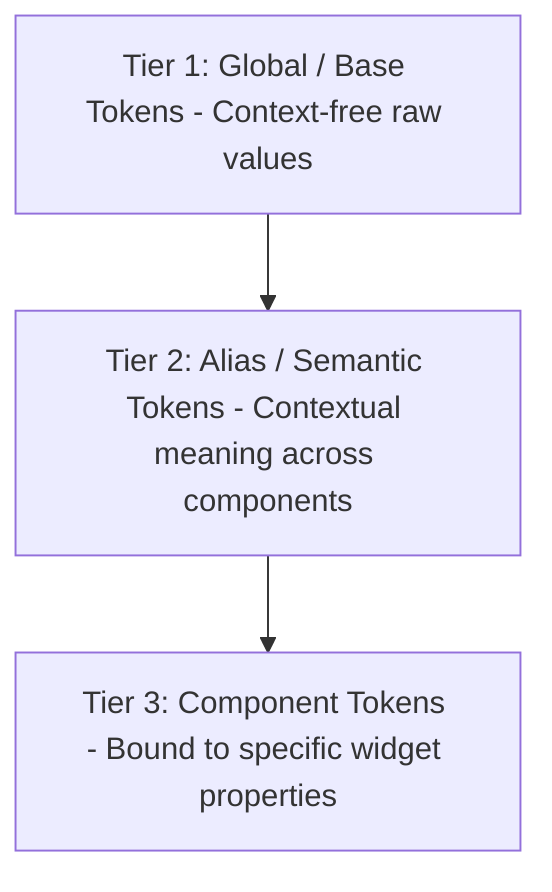
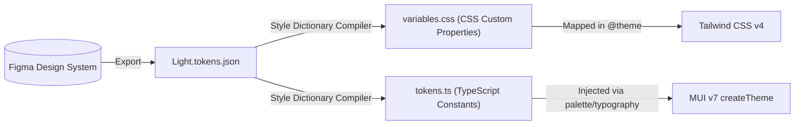
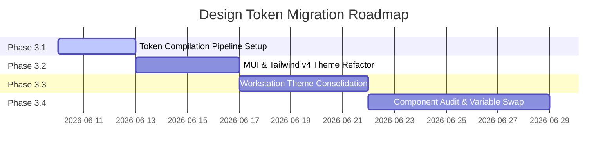
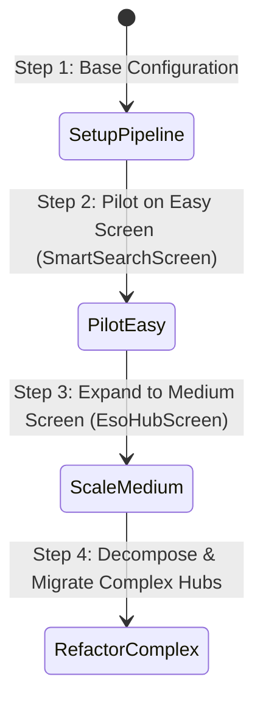

# Style & CSS Architecture Audit and Unified Design Token Migration Plan

This report provides a comprehensive review of the current CSS and styling architecture in the project, identifies critical usage of hardcoded styles across key pages, categorizes every single screen file under the `src` directory by complexity, and proposes a step-by-step roadmap showing where to start the design token migration.

---

## Phase 1: Style & CSS Architecture Audit

A scan of the repository reveals that styling is split between **Tailwind CSS v4**, **Material UI (MUI) v7**, and **custom local theme constants**. Below is a directory-by-directory mapping of files defining styles, colors, and layout patterns:

### 1. Global Themes & Configuration
* **[Light.tokens.json](file:///c:/Users/danilo.assuncao/Documents/Codex/2026-04-18-this-is-https-radixeng-dev-azure/bd-ai-poc/design-system/Light.tokens.json)**
  * **Mechanism:** JSON-based Design Tokens.
  * **Description:** Represents design variables exported from Figma. It contains design system tokens under keys like `brand`, `accent`, `text`, `action`, `divider`, and `_states`. Each token defines its `$type`, `$value` (which includes raw hex and sRGB components), `$description`, and figma-specific `$extensions`.
* **[theme.ts](file:///c:/Users/danilo.assuncao/Documents/Codex/2026-04-18-this-is-https-radixeng-dev-azure/bd-ai-poc/src/theme.ts)**
  * **Mechanism:** Material UI (MUI) Theme config (`createTheme`) & hardcoded `activeTheme` object.
  * **Description:** Configures the main MUI layout and component behavior. It holds `activeTheme` with hardcoded color variables (e.g. primary `#044ED7`, secondary `#00C2EC`, success `#00AF95`, etc.) and feeds them into MUI's theme provider. It overrides styles for components like `MuiPaper`, `MuiButton`, `MuiCard`, `MuiTextField`, `MuiSelect`, and `MuiAppBar`. It also defines custom styling presets (`drawerHeaderIconButtonSx`, `lightHeaderIconButtonSx`, `lightDrawerPanelSx`, etc.) exported for manual import.
* **[index.css](file:///c:/Users/danilo.assuncao/Documents/Codex/2026-04-18-this-is-https-radixeng-dev-azure/bd-ai-poc/src/index.css)**
  * **Mechanism:** Global CSS Stylesheet.
  * **Description:** Acts as the CSS entry point. It imports the Tailwind CSS library (`@import "tailwindcss";`) and pulls external typography from Google Fonts (`Inter` and `Dancing Script`).

### 2. Feature-Specific Styling
* **[theme.ts (Workstation)](file:///c:/Users/danilo.assuncao/Documents/Codex/2026-04-18-this-is-https-radixeng-dev-azure/bd-ai-poc/src/workstation/theme.ts)**
  * **Mechanism:** Local Domain-Specific Styling Constants.
  * **Description:** Defines specific color mapping and visual helpers for the workstation dashboard. It manually duplicates colors from the `Light.tokens.json` file into custom constants (`tokenBrand`, `tokenError`, `tokenWarning`, etc.) and constructs complex visual objects like `workstationVisuals` (borders, shadows, custom radial gradients), `workstationChartSemantic` (good, bad, warn, neutral), priority-based styles (`workstationPriorityTone`), timeline Gantt tones (`workstationTimelineTone`), and SQDCP domain colors (`workstationSqdcpTone`).

### 3. Design Documentation
* **[MASTER.md (Smart Factory)](file:///c:/Users/danilo.assuncao/Documents/Codex/2026-04-18-this-is-https-radixeng-dev-azure/bd-ai-poc/design-system/smart-factory/MASTER.md)**
  * **Mechanism:** Markdown Guideline.
  * **Description:** Serves as design documentation showing the global styling rules, target typography, spacing scale, button CSS specs, card rules, and anti-patterns.
* **[MASTER.md (Smart Factory Document Management)](file:///c:/Users/danilo.assuncao/Documents/Codex/2026-04-18-this-is-https-radixeng-dev-azure/bd-ai-poc/design-system/smart-factory-document-management/MASTER.md)**
  * **Mechanism:** Markdown Guideline.
  * **Description:** Documentation of styling guidelines, spacing, and layout specifications matching the "Liquid Glass" theme category.

---

## Phase 2: Hard-Coded Styling & Usage Mapping

Across the source tree, there are thousands of lines containing raw inline colors, ad-hoc font weights, and spacing numbers that bypass the centralized MUI theme. Below is a mapping of prominent files using hard-coded styling and exact code blocks that require remediation:

### 1. [MaintenancePlan.tsx](file:///c:/Users/danilo.assuncao/Documents/Codex/2026-04-18-this-is-https-radixeng-dev-azure/bd-ai-poc/src/Maintenance/pages/MaintenancePlan.tsx)
* **Example A: Status Tones in Component State Helpers**
  The screen maps active status badge colors to hardcoded HEX constants instead of semantic status colors in the theme:
  ```typescript
  function statusChipSx(status: string) {
    if (status === 'Active') return { bgcolor: '#DCFCE7', color: '#16A34A', borderColor: '#BBF7D0' };
    if (status === 'Approved') return { bgcolor: '#E0E7FF', color: '#2563EB', borderColor: '#C7D2FE' };
    return { bgcolor: '#F1F5F9', color: '#64748B', borderColor: '#E2E8F0' };
  }
  ```
* **Example B: Inline Custom Button Styling Variables**
  The component defines a custom local style block with hardcoded background colors, borders, and margins:
  ```typescript
  const actionButtonSx = {
    height: 36,
    px: 1.5,
    borderRadius: 1.4,
    borderColor: '#E2E8F0',
    color: '#303744',
    bgcolor: '#F8FAFC',
    textTransform: 'none',
    fontWeight: 800,
    fontSize: '0.78rem',
    whiteSpace: 'nowrap',
    '&:hover': {
      bgcolor: '#F1F5F9',
      borderColor: '#CBD5E1',
    },
  } as const;
  ```
* **Example C: Form Field Overrides**
  Local styles define text field outlines and background tones using static color strings:
  ```typescript
  const inputSx = {
    '& .MuiOutlinedInput-root': {
      height: 37,
      borderRadius: 1.5,
      bgcolor: '#F8FAFC',
      color: '#303744',
      fontSize: '0.82rem',
      '& fieldset': { borderColor: '#E2E8F0' },
    },
  } as const;
  ```

### 2. [DocumentManagementScreen.tsx](file:///c:/Users/danilo.assuncao/Documents/Codex/2026-04-18-this-is-https-radixeng-dev-azure/bd-ai-poc/src/documentManagement/DocumentManagementScreen.tsx)
* **Example A: Private Local Color Mapping**
  Instead of importing colors from the design token system, this file defines a private colors palette object with raw HEX codes:
  ```typescript
  const localColors = {
    blue: '#044ED7',
    brightBlue: '#1D74FF',
    lightBlue: '#00C2EC',
    deepBlue: '#1F2366',
    darkBlue: '#060A3D',
    orange: '#FF6E00',
    yellow: '#FFB500',
    gray10: '#EBEDF0',
    gray30: '#BCBEC0',
    gray60: '#808285',
    gray90: '#3D3F41',
  };
  ```
* **Example B: Custom Status Chip Styles**
  Ad-hoc status mappings use local values:
  ```typescript
  const statusColors = {
    Draft:       { color: '#044ED7', bg: '#EBEDF0' },
    'In Review': { color: '#FF6E00', bg: '#fff3e0' },
    Approved:    { color: '#1b5e20', bg: '#e8f5e9' },
    Published:   { color: '#006064', bg: '#e0f7fa' },
  };
  ```
* **Example C: Hardcoded SVG Visual Attributes**
  Inline SVG templates draw borders and fills manually:
  ```xml
  <rect x="1.25" y="0.75" width="19.5" height="14.5" rx="2.25" stroke="#9e9e9e" strokeWidth="0.5" opacity="0.5"/>
  ```

### 3. [WorkOrderHubScreen.tsx](file:///c:/Users/danilo.assuncao/Documents/Codex/2026-04-18-this-is-https-radixeng-dev-azure/bd-ai-poc/src/shopfloor/components/WorkOrderHubScreen.tsx)
* **Example A: Hardcoded Box Backgrounds and Margins**
  Box boundaries bypass the MUI spacing hierarchy:
  ```typescript
  <Box sx={{ flexGrow: 1, overflowY: 'auto', bgcolor: '#EBEDF0', p: { xs: 2, md: 4 } }}>
  ```
* **Example B: Custom Card Gradients and Text Shadows**
  The main banner specifies an absolute visual gradient block:
  ```typescript
  <Paper sx={{ p: { xs: 2.5, md: 3 }, mb: 3, background: 'linear-gradient(135deg, #1F2366, #0f766e)', color: 'white', border: 'none' }}>
  ```
* **Example C: Hardcoded Button Accent Overrides**
  Clickable controls introduce colors not found in the global theme context:
  ```typescript
  <Button sx={{ bgcolor: '#0f766e', '&:hover': { bgcolor: '#115e59' } }}>
  ```

---

## Phase 3: Unified Design Token Migration Plan

To move this codebase to a robust, scalable governance model, we propose establishing a **3-Tier Design Token Architecture** mapping the figma tokens in `Light.tokens.json` to both **Tailwind v4** and **MUI v7**.

### 1. Token Structure Recommendations

We will organize the system into three sequential token tiers:



* **Tier 1 (Global/Base Tokens):** Context-free design primitives (colors, raw sizes, fonts).
  * *Example:* `--token-color-blue-500: #1F63EA;`, `--token-spacing-16: 16px;`
* **Tier 2 (Alias/Semantic Tokens):** Maps Tier 1 primitives to semantic intent (status, roles).
  * *Example:* `--token-color-primary-main: var(--token-color-blue-500);`, `--token-color-status-success: var(--token-color-green-400);`
* **Tier 3 (Component Tokens):** Fine-grained values locked to individual component elements.
  * *Example:* `--token-button-primary-bgcolor: var(--token-color-primary-main);`, `--token-chart-grid-stroke: var(--token-color-neutral-300);`

---

### 2. Implementation Strategy

Based on the React 19 + Vite + Tailwind v4 + MUI v7 setup, we recommend the following toolchain integration:



1. **Build Tool (Style Dictionary):** Use Style Dictionary (or a lightweight build script in `.scripts/build-tokens.js`) to parse `Light.tokens.json`.
2. **Targets Generated:**
   * **CSS variables (`src/theme/variables.css`):** Exposes tokens as standard CSS custom properties.
   * **TypeScript variables (`src/theme/tokens.ts`):** Exposes tokens as strongly-typed TS objects.
3. **Tailwind CSS v4 Integration:** 
   Tailwind v4 deprecates `tailwind.config.js` and configures custom themes inside CSS files. We map CSS properties directly in `src/index.css`:
   ```css
   @import "tailwindcss";
   @import "./theme/variables.css";

   @theme {
     --color-primary: var(--token-brand-main);
     --color-success: var(--token-success-main);
     --spacing-md: var(--token-space-md);
   }
   ```
4. **MUI v7 Integration:**
   In `src/theme.ts`, use CSS Custom Properties or import generated TS constants to create a dynamic theme. Extend MUI's default types using **Module Augmentation** so developers get autocompletion:
   ```typescript
   // src/theme/themeAugmentation.d.ts
   declare module '@mui/material/styles' {
     interface Palette {
       brand: Palette['primary'] & {
         darkest: string;
         lightest: string;
       };
     }
     interface PaletteOptions {
       brand?: Partial<Palette['brand']>;
     }
   }
   ```

---

### 3. Migration Steps

To perform this migration systematically without breaking the running user interface, we recommend a four-phase rollout:



#### Step 3.1: Pipeline Setup & Token Generation
* Setup Style Dictionary configuration reading from `design-system/Light.tokens.json`.
* Output files `src/theme/variables.css` and `src/theme/tokens.ts`.
* Validate that raw values in `Light.tokens.json` correctly correspond to existing values inside `theme.ts` (e.g., matching `#1F63EA` vs `#044ED7`).

#### Step 3.2: Centralize in global stylesheets
* Update `src/index.css` to import `src/theme/variables.css` and map properties inside `@theme`.
* Modify `src/theme.ts` to map colors to CSS variables (e.g. `var(--token-brand-main)`) instead of inline HEX codes.

#### Step 3.3: Consolidate workstation variables
* Replace the duplicated color properties in `src/workstation/theme.ts` with references to generated tokens or the global MUI theme object.
* Augment the MUI Theme type declarations to support custom chart and workstation semantic colors, so BAs can access them securely using `theme.appTokens.status` or `theme.palette.brand`.

#### Step 3.4: Systematic replacement of hardcoded values
* Identify all TSX files using hardcoded hex codes.
* Replace raw inline styles with standard MUI properties (e.g. replacing `bgcolor: '#EBEDF0'` with `bgcolor: 'background.default'`).
* Swap inline color objects with theme palette values (e.g., using `theme.palette.success.main` instead of `#16A34A` or `#66BB6A`).

---

## Phase 4: Screen Complexity Classification & Start Plan

To provide a complete migration map, every page and component screen file under `src/` has been evaluated and assigned a complexity level.

### 1. Complete Complexity Matrix of All Screens

#### A. Easy Complexity Screens (Low styling overhead, basic forms/inputs)
* **Authentication:**
  * [LoginScreen.tsx](file:///c:/Users/danilo.assuncao/Documents/Codex/2026-04-18-this-is-https-radixeng-dev-azure/bd-ai-poc/src/auth/LoginScreen.tsx)
* **AI & Home Screen Hubs:**
  * [AiHomeScreen.tsx](file:///c:/Users/danilo.assuncao/Documents/Codex/2026-04-18-this-is-https-radixeng-dev-azure/bd-ai-poc/src/aiHome/components/AiHomeScreen.tsx)
  * [SmartSearchScreen.tsx](file:///c:/Users/danilo.assuncao/Documents/Codex/2026-04-18-this-is-https-radixeng-dev-azure/bd-ai-poc/src/aiHome/components/SmartSearchScreen.tsx)
* **Document Management (Dialogs/Select):**
  * [DocumentTemplateSelectionScreen.tsx](file:///c:/Users/danilo.assuncao/Documents/Codex/2026-04-18-this-is-https-radixeng-dev-azure/bd-ai-poc/src/documentManagement/DocumentTemplateSelectionScreen.tsx)
  * [DocumentReviewFlowScreen.tsx](file:///c:/Users/danilo.assuncao/Documents/Codex/2026-04-18-this-is-https-radixeng-dev-azure/bd-ai-poc/src/documentManagement/DocumentReviewFlowScreen.tsx)
  * [DocumentArtifactCreationScreen.tsx](file:///c:/Users/danilo.assuncao/Documents/Codex/2026-04-18-this-is-https-radixeng-dev-azure/bd-ai-poc/src/documentManagement/DocumentArtifactCreationScreen.tsx)
* **Shift Management (Dialogs):**
  * [ShiftScheduleOperatorPage.tsx](file:///c:/Users/danilo.assuncao/Documents/Codex/2026-04-18-this-is-https-radixeng-dev-azure/bd-ai-poc/src/shiftManagement/pages/construction/ShiftScheduleOperatorPage.tsx)
  * [ShiftMemberProfileDialog.tsx](file:///c:/Users/danilo.assuncao/Documents/Codex/2026-04-18-this-is-https-radixeng-dev-azure/bd-ai-poc/src/shiftManagement/components/ShiftMemberProfileDialog.tsx)
  * [ShiftTeamManagementMemberDialog.tsx](file:///c:/Users/danilo.assuncao/Documents/Codex/2026-04-18-this-is-https-radixeng-dev-azure/bd-ai-poc/src/shiftManagement/components/ShiftTeamManagementMemberDialog.tsx)
* **Shopfloor Routine Screens:**
  * [CilCenterLineOperatorPage.tsx](file:///c:/Users/danilo.assuncao/Documents/Codex/2026-04-18-this-is-https-radixeng-dev-azure/bd-ai-poc/src/shopfloor/components/construction/CilCenterLineOperatorPage.tsx)
  * [EquipmentChangeoverOperatorPage.tsx](file:///c:/Users/danilo.assuncao/Documents/Codex/2026-04-18-this-is-https-radixeng-dev-azure/bd-ai-poc/src/shopfloor/components/construction/EquipmentChangeoverOperatorPage.tsx)
* **Production Planning Panels:**
  * [AICopilotPanel.tsx](file:///c:/Users/danilo.assuncao/Documents/Codex/2026-04-18-this-is-https-radixeng-dev-azure/bd-ai-poc/src/productionPlanning/workOrders/components/AICopilotPanel.tsx)
  * [BluAIRecommendationPanel.tsx](file:///c:/Users/danilo.assuncao/Documents/Codex/2026-04-18-this-is-https-radixeng-dev-azure/bd-ai-poc/src/productionPlanning/scenarioPlanning/components/BluAIRecommendationPanel.tsx)
  * [KeyInsightsPanel.tsx](file:///c:/Users/danilo.assuncao/Documents/Codex/2026-04-18-this-is-https-radixeng-dev-azure/bd-ai-poc/src/productionPlanning/scenarioPlanning/components/KeyInsightsPanel.tsx)
  * [ScenarioActionsPanel.tsx](file:///c:/Users/danilo.assuncao/Documents/Codex/2026-04-18-this-is-https-radixeng-dev-azure/bd-ai-poc/src/productionPlanning/scenarioPlanning/components/ScenarioActionsPanel.tsx)
  * [ScenarioAssumptionsPanel.tsx](file:///c:/Users/danilo.assuncao/Documents/Codex/2026-04-18-this-is-https-radixeng-dev-azure/bd-ai-poc/src/productionPlanning/scenarioPlanning/components/ScenarioAssumptionsPanel.tsx)
  * [ScenarioChangesPanel.tsx](file:///c:/Users/danilo.assuncao/Documents/Codex/2026-04-18-this-is-https-radixeng-dev-azure/bd-ai-poc/src/productionPlanning/scenarioPlanning/components/ScenarioChangesPanel.tsx)
  * [ScenarioListPanel.tsx](file:///c:/Users/danilo.assuncao/Documents/Codex/2026-04-18-this-is-https-radixeng-dev-azure/bd-ai-poc/src/productionPlanning/scenarioPlanning/components/ScenarioListPanel.tsx)
  * [SuggestedActionsPanel.tsx](file:///c:/Users/danilo.assuncao/Documents/Codex/2026-04-18-this-is-https-radixeng-dev-azure/bd-ai-poc/src/productionPlanning/scenarioPlanning/components/SuggestedActionsPanel.tsx)
  * [TopImpactedProductsPanel.tsx](file:///c:/Users/danilo.assuncao/Documents/Codex/2026-04-18-this-is-https-radixeng-dev-azure/bd-ai-poc/src/productionPlanning/scenarioPlanning/components/TopImpactedProductsPanel.tsx)
  * [DemandRiskDetailPanel.tsx](file:///c:/Users/danilo.assuncao/Documents/Codex/2026-04-18-this-is-https-radixeng-dev-azure/bd-ai-poc/src/productionPlanning/priorityQueue/components/DemandRiskDetailPanel.tsx)
  * [RiskDetailPanel.tsx](file:///c:/Users/danilo.assuncao/Documents/Codex/2026-04-18-this-is-https-radixeng-dev-azure/bd-ai-poc/src/productionPlanning/priorityQueue/components/RiskDetailPanel.tsx)
  * [WoDetailPanel.tsx](file:///c:/Users/danilo.assuncao/Documents/Codex/2026-04-18-this-is-https-radixeng-dev-azure/bd-ai-poc/src/productionPlanning/priorityQueue/components/WoDetailPanel.tsx)
* **Application Shell:**
  * [AppErrorBoundary.tsx](file:///c:/Users/danilo.assuncao/Documents/Codex/2026-04-18-this-is-https-radixeng-dev-azure/bd-ai-poc/src/common/components/AppErrorBoundary.tsx)

#### B. Medium Complexity Screens (Operational layouts, data tables, simple charts)
* **AI & Home Screen Hubs:**
  * [MyAiAssistantExpandedScreen.tsx](file:///c:/Users/danilo.assuncao/Documents/Codex/2026-04-18-this-is-https-radixeng-dev-azure/bd-ai-poc/src/aiHome/components/MyAiAssistantExpandedScreen.tsx)
  * [MyAiAssistantExpandedMobileScreen.tsx](file:///c:/Users/danilo.assuncao/Documents/Codex/2026-04-18-this-is-https-radixeng-dev-azure/bd-ai-poc/src/aiHome/components/MyAiAssistantExpandedMobileScreen.tsx)
* **Action Tracker:**
  * [ActionTrackerScreen.tsx](file:///c:/Users/danilo.assuncao/Documents/Codex/2026-04-18-this-is-https-radixeng-dev-azure/bd-ai-poc/src/actionTracker/components/ActionTrackerScreen.tsx)
* **Control Tower:**
  * [ControlTowerScreen.tsx](file:///c:/Users/danilo.assuncao/Documents/Codex/2026-04-18-this-is-https-radixeng-dev-azure/bd-ai-poc/src/controlTower/ControlTowerScreen.tsx)
* **Document Management Pages:**
  * [DocumentAIHubScreen.tsx](file:///c:/Users/danilo.assuncao/Documents/Codex/2026-04-18-this-is-https-radixeng-dev-azure/bd-ai-poc/src/documentManagement/DocumentAIHubScreen.tsx)
  * [DocumentAdvancedSearchScreen.tsx](file:///c:/Users/danilo.assuncao/Documents/Codex/2026-04-18-this-is-https-radixeng-dev-azure/bd-ai-poc/src/documentManagement/DocumentAdvancedSearchScreen.tsx)
  * [DocumentVersionHistoryScreen.tsx](file:///c:/Users/danilo.assuncao/Documents/Codex/2026-04-18-this-is-https-radixeng-dev-azure/bd-ai-poc/src/documentManagement/DocumentVersionHistoryScreen.tsx)
  * [DocumentESignatureScreen.tsx](file:///c:/Users/danilo.assuncao/Documents/Codex/2026-04-18-this-is-https-radixeng-dev-azure/bd-ai-poc/src/documentManagement/DocumentESignatureScreen.tsx)
  * [DocumentAuditTrailScreen.tsx](file:///c:/Users/danilo.assuncao/Documents/Codex/2026-04-18-this-is-https-radixeng-dev-azure/bd-ai-poc/src/documentManagement/DocumentAuditTrailScreen.tsx)
  * [DocumentSearchExplorerScreen.tsx](file:///c:/Users/danilo.assuncao/Documents/Codex/2026-04-18-this-is-https-radixeng-dev-azure/bd-ai-poc/src/documentManagement/DocumentSearchExplorerScreen.tsx)
  * [DocumentComplianceDashboard.tsx](file:///c:/Users/danilo.assuncao/Documents/Codex/2026-04-18-this-is-https-radixeng-dev-azure/bd-ai-poc/src/documentManagement/DocumentComplianceDashboard.tsx)
  * [DocumentOperationsDashboard.tsx](file:///c:/Users/danilo.assuncao/Documents/Codex/2026-04-18-this-is-https-radixeng-dev-azure/bd-ai-poc/src/documentManagement/DocumentOperationsDashboard.tsx)
  * [DocumentRevisionApprovalScreen.tsx](file:///c:/Users/danilo.assuncao/Documents/Codex/2026-04-18-this-is-https-radixeng-dev-azure/bd-ai-poc/src/documentManagement/DocumentRevisionApprovalScreen.tsx)
* **Maintenance Pages:**
  * [MaintenanceFollowUpBoardPage.tsx](file:///c:/Users/danilo.assuncao/Documents/Codex/2026-04-18-this-is-https-radixeng-dev-azure/bd-ai-poc/src/Maintenance/pages/MaintenanceFollowUpBoardPage.tsx)
  * [SparePartsManagementPage.tsx](file:///c:/Users/danilo.assuncao/Documents/Codex/2026-04-18-this-is-https-radixeng-dev-azure/bd-ai-poc/src/Maintenance/pages/SparePartsManagementPage.tsx)
  * [MaintenancePlannerPage.tsx](file:///c:/Users/danilo.assuncao/Documents/Codex/2026-04-18-this-is-https-radixeng-dev-azure/bd-ai-poc/src/Maintenance/pages/MaintenancePlannerPage.tsx)
  * [MaintenancePerformancePage.tsx](file:///c:/Users/danilo.assuncao/Documents/Codex/2026-04-18-this-is-https-radixeng-dev-azure/bd-ai-poc/src/Maintenance/pages/MaintenancePerformancePage.tsx)
  * [MaintenanceCbmPdmPage.tsx](file:///c:/Users/danilo.assuncao/Documents/Codex/2026-04-18-this-is-https-radixeng-dev-azure/bd-ai-poc/src/Maintenance/pages/MaintenanceCbmPdmPage.tsx)
* **Shopfloor Widgets & Screens:**
  * [LinePerformanceScreen.tsx](file:///c:/Users/danilo.assuncao/Documents/Codex/2026-04-18-this-is-https-radixeng-dev-azure/bd-ai-poc/src/shopfloor/components/LinePerformanceScreen.tsx)
  * [EsoHubScreen.tsx](file:///c:/Users/danilo.assuncao/Documents/Codex/2026-04-18-this-is-https-radixeng-dev-azure/bd-ai-poc/src/shopfloor/components/EsoHubScreen.tsx)
  * [EquipmentChangeoverScreen.tsx](file:///c:/Users/danilo.assuncao/Documents/Codex/2026-04-18-this-is-https-radixeng-dev-azure/bd-ai-poc/src/shopfloor/components/EquipmentChangeoverScreen.tsx)
  * [ManageTasksScreen.tsx](file:///c:/Users/danilo.assuncao/Documents/Codex/2026-04-18-this-is-https-radixeng-dev-azure/bd-ai-poc/src/shopfloor/components/ManageTasksScreen.tsx)
  * [CiltKpisScreen.tsx](file:///c:/Users/danilo.assuncao/Documents/Codex/2026-04-18-this-is-https-radixeng-dev-azure/bd-ai-poc/src/shopfloor/components/CiltKpisScreen.tsx)
  * [NotificationDashboardScreen.tsx](file:///c:/Users/danilo.assuncao/Documents/Codex/2026-04-18-this-is-https-radixeng-dev-azure/bd-ai-poc/src/shopfloor/components/NotificationDashboardScreen.tsx)
  * [NotificationDashboard.tsx](file:///c:/Users/danilo.assuncao/Documents/Codex/2026-04-18-this-is-https-radixeng-dev-azure/bd-ai-poc/src/shopfloor/components/NotificationDashboard.tsx)
  * [WorkOrderHubScreen.tsx](file:///c:/Users/danilo.assuncao/Documents/Codex/2026-04-18-this-is-https-radixeng-dev-azure/bd-ai-poc/src/shopfloor/components/WorkOrderHubScreen.tsx)
* **Shift Management Pages:**
  * [ShiftPlannerScreen.tsx](file:///c:/Users/danilo.assuncao/Documents/Codex/2026-04-18-this-is-https-radixeng-dev-azure/bd-ai-poc/src/shiftManagement/components/ShiftPlannerScreen.tsx)
  * [ShiftScheduleScreen.tsx](file:///c:/Users/danilo.assuncao/Documents/Codex/2026-04-18-this-is-https-radixeng-dev-azure/bd-ai-poc/src/shiftManagement/components/ShiftScheduleScreen.tsx)
  * [ShiftSiteOrganogramScreen.tsx](file:///c:/Users/danilo.assuncao/Documents/Codex/2026-04-18-this-is-https-radixeng-dev-azure/bd-ai-poc/src/shiftManagement/components/ShiftSiteOrganogramScreen.tsx)
  * [ShiftTeamManagementScreen.tsx](file:///c:/Users/danilo.assuncao/Documents/Codex/2026-04-18-this-is-https-radixeng-dev-azure/bd-ai-poc/src/shiftManagement/components/ShiftTeamManagementScreen.tsx)
* **Production Planning Dashboards:**
  * [ScenarioPlanningPage.tsx](file:///c:/Users/danilo.assuncao/Documents/Codex/2026-04-18-this-is-https-radixeng-dev-azure/bd-ai-poc/src/productionPlanning/scenarioPlanning/ScenarioPlanningPage.tsx)
  * [WorkOrdersPage.tsx](file:///c:/Users/danilo.assuncao/Documents/Codex/2026-04-18-this-is-https-radixeng-dev-azure/bd-ai-poc/src/productionPlanning/workOrders/WorkOrdersPage.tsx)
  * [WorkOrderManagementScreen.tsx](file:///c:/Users/danilo.assuncao/Documents/Codex/2026-04-18-this-is-https-radixeng-dev-azure/bd-ai-poc/src/productionPlanning/workOrders/WorkOrderManagementScreen.tsx)
  * [MrpPlanningPage.tsx](file:///c:/Users/danilo.assuncao/Documents/Codex/2026-04-18-this-is-https-radixeng-dev-azure/bd-ai-poc/src/productionPlanning/mrp/MrpPlanningPage.tsx)
  * [MrpVersionsPage.tsx](file:///c:/Users/danilo.assuncao/Documents/Codex/2026-04-18-this-is-https-radixeng-dev-azure/bd-ai-poc/src/productionPlanning/mrp/MrpVersionsPage.tsx)
  * [MrpCombinedPage.tsx](file:///c:/Users/danilo.assuncao/Documents/Codex/2026-04-18-this-is-https-radixeng-dev-azure/bd-ai-poc/src/productionPlanning/mrp/MrpCombinedPage.tsx)
  * [WoReadinessPage.tsx](file:///c:/Users/danilo.assuncao/Documents/Codex/2026-04-18-this-is-https-radixeng-dev-azure/bd-ai-poc/src/productionPlanning/woReadiness/WoReadinessPage.tsx)
  * [SchedulePlanningPage.tsx](file:///c:/Users/danilo.assuncao/Documents/Codex/2026-04-18-this-is-https-radixeng-dev-azure/bd-ai-poc/src/productionPlanning/scheduleVersions/SchedulePlanningPage.tsx)
  * [ScheduleVersionsPage.tsx](file:///c:/Users/danilo.assuncao/Documents/Codex/2026-04-18-this-is-https-radixeng-dev-azure/bd-ai-poc/src/productionPlanning/scheduleVersions/ScheduleVersionsPage.tsx)
  * [ScheduleVersionsCombinedPage.tsx](file:///c:/Users/danilo.assuncao/Documents/Codex/2026-04-18-this-is-https-radixeng-dev-azure/bd-ai-poc/src/productionPlanning/scheduleVersions/ScheduleVersionsCombinedPage.tsx)
  * [ScheduleOrderCombinedPage.tsx](file:///c:/Users/danilo.assuncao/Documents/Codex/2026-04-18-this-is-https-radixeng-dev-azure/bd-ai-poc/src/productionPlanning/scheduleVersions/ScheduleOrderCombinedPage.tsx)
  * [PriorityQueuePage.tsx](file:///c:/Users/danilo.assuncao/Documents/Codex/2026-04-18-this-is-https-radixeng-dev-azure/bd-ai-poc/src/productionPlanning/priorityQueue/PriorityQueuePage.tsx)
  * [PlanningLineagePage.tsx](file:///c:/Users/danilo.assuncao/Documents/Codex/2026-04-18-this-is-https-radixeng-dev-azure/bd-ai-poc/src/productionPlanning/planningLineage/PlanningLineagePage.tsx)
  * [MaterialAndWarehousePage.tsx](file:///c:/Users/danilo.assuncao/Documents/Codex/2026-04-18-this-is-https-radixeng-dev-azure/bd-ai-poc/src/productionPlanning/materialAndWarehouse/MaterialAndWarehousePage.tsx)
  * [MpsPlanningPage.tsx](file:///c:/Users/danilo.assuncao/Documents/Codex/2026-04-18-this-is-https-radixeng-dev-azure/bd-ai-poc/src/productionPlanning/monthlyMps/MpsPlanningPage.tsx)
  * [MpsVersionsPage.tsx](file:///c:/Users/danilo.assuncao/Documents/Codex/2026-04-18-this-is-https-radixeng-dev-azure/bd-ai-poc/src/productionPlanning/monthlyMps/MpsVersionsPage.tsx)
  * [MpsCombinedPage.tsx](file:///c:/Users/danilo.assuncao/Documents/Codex/2026-04-18-this-is-https-radixeng-dev-azure/bd-ai-poc/src/productionPlanning/monthlyMps/MpsCombinedPage.tsx)
  * [OrdersPlanningV2Page.tsx](file:///c:/Users/danilo.assuncao/Documents/Codex/2026-04-18-this-is-https-radixeng-dev-azure/bd-ai-poc/src/productionPlanning/ordersPlanningV2/OrdersPlanningV2Page.tsx)
* **Tier Meeting:**
  * [TierMeetingScreen.tsx](file:///c:/Users/danilo.assuncao/Documents/Codex/2026-04-18-this-is-https-radixeng-dev-azure/bd-ai-poc/src/tierMeeting/components/TierMeetingScreen.tsx)
* **Workstation Screen Hubs:**
  * [WorkstationScreen.tsx](file:///c:/Users/danilo.assuncao/Documents/Codex/2026-04-18-this-is-https-radixeng-dev-azure/bd-ai-poc/src/workstation/components/WorkstationScreen.tsx)
  * [AllWorkstationsPage.tsx](file:///c:/Users/danilo.assuncao/Documents/Codex/2026-04-18-this-is-https-radixeng-dev-azure/bd-ai-poc/src/workstation/allworkstation/AllWorkstationsPage.tsx)
  * [MyLossFocusedKpisPage.tsx](file:///c:/Users/danilo.assuncao/Documents/Codex/2026-04-18-this-is-https-radixeng-dev-azure/bd-ai-poc/src/workstation/components/MyLossFocusedKpisPage.tsx)
  * [MyCenterlineExecutionScreen.tsx](file:///c:/Users/danilo.assuncao/Documents/Codex/2026-04-18-this-is-https-radixeng-dev-azure/bd-ai-poc/src/workstation/components/MyCenterlineExecutionScreen.tsx)
  * [MyCiltExecutionScreen.tsx](file:///c:/Users/danilo.assuncao/Documents/Codex/2026-04-18-this-is-https-radixeng-dev-azure/bd-ai-poc/src/workstation/components/MyCiltExecutionScreen.tsx)
  * [MyChangeoverExecutionScreen.tsx](file:///c:/Users/danilo.assuncao/Documents/Codex/2026-04-18-this-is-https-radixeng-dev-azure/bd-ai-poc/src/workstation/components/MyChangeoverExecutionScreen.tsx)
  * [MyQualityExpanded.tsx](file:///c:/Users/danilo.assuncao/Documents/Codex/2026-04-18-this-is-https-radixeng-dev-azure/bd-ai-poc/src/workstation/components/MyQualityExpanded.tsx)
  * [MySafetyExpanded.tsx](file:///c:/Users/danilo.assuncao/Documents/Codex/2026-04-18-this-is-https-radixeng-dev-azure/bd-ai-poc/src/workstation/components/MySafetyExpanded.tsx)
  * [MyShiftOeeExpanded.tsx](file:///c:/Users/danilo.assuncao/Documents/Codex/2026-04-18-this-is-https-radixeng-dev-azure/bd-ai-poc/src/workstation/components/MyShiftOeeExpanded.tsx)
* **Workstation Custom Widgets (Modular Widget System):**
  * Consists of ~60 separate files (e.g. `MyQualityWidget.tsx`, `MyRecognitionWidget.tsx`, `MySafetyWidget.tsx`, `MyScrapWidget.tsx`, `MyShiftOeeWidget.tsx`, `MyShiftProductionWidget.tsx`, `MyShiftScheduleWidget.tsx`, `MyTasksWidget.tsx`, `MyThreePTrackingWidget.tsx`, `MyTierManagementWidget.tsx`, `MyTopLossesWidget.tsx`, `MyZonePerformanceWidget.tsx`, `OEEMonitoringWidget.tsx`, `WidgetWorkOrders.tsx`, `WorkstationHourlyOutputWidget.tsx`, `WorkstationLineRoutinesWidget.tsx`, `WorkstationLineStatusWidget.tsx`, `WorkstationOpenMaintenanceRequestWidget.tsx`, `WorkstationProductionVsTargetWidget.tsx`, `WorkstationRankedMetricWidget.tsx`, `WorkstationTopDowntimeCausesWidget.tsx`, etc.). Swapping styling is simple but highly repetitive.

#### C. Complex Complexity Screens (Heavy customized layouts, visual dashboards, monolithic hubs)
* **Document Management Pages:**
  * [DocumentManagementScreen.tsx](file:///c:/Users/danilo.assuncao/Documents/Codex/2026-04-18-this-is-https-radixeng-dev-azure/bd-ai-poc/src/documentManagement/DocumentManagementScreen.tsx) *(~190 KB)*
  * [DocumentWorkflowEngineScreen.tsx](file:///c:/Users/danilo.assuncao/Documents/Codex/2026-04-18-this-is-https-radixeng-dev-azure/bd-ai-poc/src/documentManagement/DocumentWorkflowEngineScreen.tsx) *(~110 KB)*
  * [DocumentArtifactDetailScreen.tsx](file:///c:/Users/danilo.assuncao/Documents/Codex/2026-04-18-this-is-https-radixeng-dev-azure/bd-ai-poc/src/documentManagement/DocumentArtifactDetailScreen.tsx) *(~88 KB)*
* **Maintenance Pages:**
  * [MaintenancePlan.tsx](file:///c:/Users/danilo.assuncao/Documents/Codex/2026-04-18-this-is-https-radixeng-dev-azure/bd-ai-poc/src/Maintenance/pages/MaintenancePlan.tsx) *(4700+ lines)*
* **Shift Entry Pages:**
  * [ShiftEntryPanel.tsx](file:///c:/Users/danilo.assuncao/Documents/Codex/2026-04-18-this-is-https-radixeng-dev-azure/bd-ai-poc/src/shiftEntry/components/ShiftEntryPanel.tsx) *(~161 KB)*
* **Global View Pages:**
  * [GlobalViewScreen.tsx](file:///c:/Users/danilo.assuncao/Documents/Codex/2026-04-18-this-is-https-radixeng-dev-azure/bd-ai-poc/src/globalView/components/GlobalViewScreen.tsx) *(~202 KB)*
* **Production Planning Pages:**
  * [ProductionPlanningScreen.tsx](file:///c:/Users/danilo.assuncao/Documents/Codex/2026-04-18-this-is-https-radixeng-dev-azure/bd-ai-poc/src/productionPlanning/ProductionPlanningScreen.tsx)
  * [TimelinePlanningView.tsx](file:///c:/Users/danilo.assuncao/Documents/Codex/2026-04-18-this-is-https-radixeng-dev-azure/bd-ai-poc/src/productionPlanning/schedulingWorkspaceTimeline/TimelinePlanningView.tsx)
* **Tier Meeting:**
  * [TierMeetingDashboard.tsx](file:///c:/Users/danilo.assuncao/Documents/Codex/2026-04-18-this-is-https-radixeng-dev-azure/bd-ai-poc/src/tierMeeting/components/TierMeetingDashboard.tsx)
* **Workstation Dashboard Hubs:**
  * [WorkstationDashboard.tsx](file:///c:/Users/danilo.assuncao/Documents/Codex/2026-04-18-this-is-https-radixeng-dev-azure/bd-ai-poc/src/workstation/components/WorkstationDashboard.tsx) *(~196 KB)*
  * [PersonalWorkstationDashboard.tsx](file:///c:/Users/danilo.assuncao/Documents/Codex/2026-04-18-this-is-https-radixeng-dev-azure/bd-ai-poc/src/workstation/components/PersonalWorkstationDashboard.tsx)
  * [StandardWorkstationDashboard.tsx](file:///c:/Users/danilo.assuncao/Documents/Codex/2026-04-18-this-is-https-radixeng-dev-azure/bd-ai-poc/src/workstation/components/StandardWorkstationDashboard.tsx)
* **Bi-directional Integration Shell:**
  * [AppContent.tsx](file:///c:/Users/danilo.assuncao/Documents/Codex/2026-04-18-this-is-https-radixeng-dev-azure/bd-ai-poc/src/AppContent.tsx)

---

### 2. Execution Start Plan (Sequencing Roadmap)

To minimize regression risk and establish clear migration patterns early, follow this 4-step start plan:



#### Step 1: Establish the Baseline (Base Config)
* Generate the CSS custom variables (`src/theme/variables.css`) from `Light.tokens.json`.
* Load variables in `index.css` and inject them into `src/theme.ts`.
* *Why:* This establishes the variables in memory before modifying single files.

#### Step 2: The Pilot Run (SmartSearchScreen)
* Target **[SmartSearchScreen.tsx](file:///c:/Users/danilo.assuncao/Documents/Codex/2026-04-18-this-is-https-radixeng-dev-azure/bd-ai-poc/src/aiHome/components/SmartSearchScreen.tsx)** as the pilot screen.
* Replace raw backgrounds, text inputs, and margins with the theme references.
* *Why:* It has no complex dependencies, is under 15 KB, and provides an immediate validation loop.

#### Step 3: Expand to Medium Complexity (EsoHubScreen)
* Migrate **[EsoHubScreen.tsx](file:///c:/Users/danilo.assuncao/Documents/Codex/2026-04-18-this-is-https-radixeng-dev-azure/bd-ai-poc/src/shopfloor/components/EsoHubScreen.tsx)**.
* Standardize custom chip statuses using semantic colors and implement Recharts wrappers referencing the design variables.
* *Why:* Validates the token implementation with actual operational data widgets.

#### Step 4: Refactor and Tackle Complex Screens (The Hubs)
* Do **NOT** attempt to rewrite [MaintenancePlan.tsx](file:///c:/Users/danilo.assuncao/Documents/Codex/2026-04-18-this-is-https-radixeng-dev-azure/bd-ai-poc/src/Maintenance/pages/MaintenancePlan.tsx) directly.
* First, extract large chunks (like dialogs, task list editors, and SVG layouts) into smaller sub-components inside `/components` folders.
* Apply design tokens to these sub-components progressively.
* *Why:* Minimizes merge conflicts and ensures visual layouts don't shift during the styling refactor.

---

## Phase 5: Governance Best Practices

To prevent visual regression and ensure developers don't re-introduce hardcoded styling variables:

1. **Static Code Analysis (ESLint & Stylelint):**
   * Introduce a linting rule (e.g., utilizing `eslint-plugin-no-hardcoded-colors` or custom regex search scripts in Git Pre-commit hooks) that flags raw HEX codes (`#000` or `#FFFFFF`) or direct CSS inline styles in TSX files.
2. **Design-to-Code Sync Automation:**
   * Build a Github Action triggering token generation automatically whenever a Figma designer publishes design variables to the repository.
3. **UI Component Guardrails (Wrappers):**
   * Encapsulate charts, tables, filters, and forms in shared components (like a `StandardChart` wrapper for Recharts or a `StatusChip` helper for alerts). BAs should configure layouts using declarative configurations, rather than writing custom styles.
4. **CI Build Gates:**
   * Add quality gates in the repository's build pipeline checking that CSS file modifications do not include raw color attributes, and require that any new visual elements consume values directly from the MUI `useTheme` hook.
